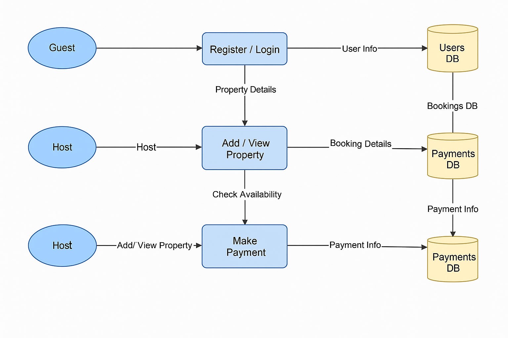

# Data Flow Diagram

This Data Flow Diagram shows how data moves through the Airbnb backend system.

It includes:
- External entities: Guest, Host
- Processes: Register/Login, Book Property, List Property, Make Payment
- Data Stores: Users DB, Properties DB, Bookings DB, Payments DB

