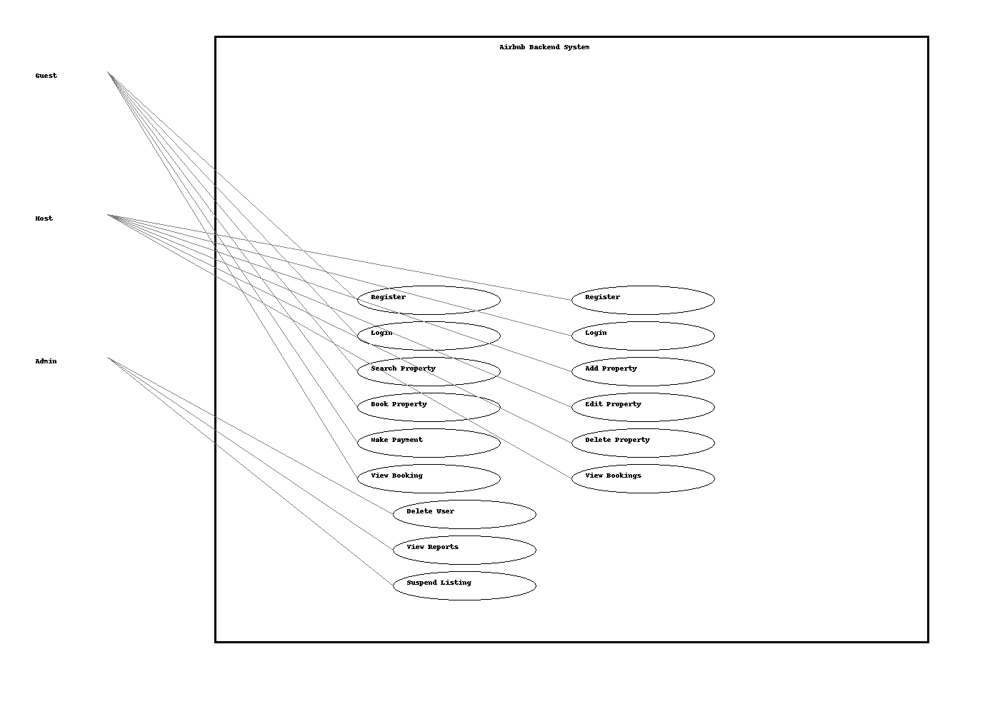

# Use Case Diagram

This use case diagram outlines the interactions between different user types and the Airbnb backend system.

## Actors:
- **Guest:** Can register, search, book, and pay.
- **Host:** Can manage properties and view bookings.
- **Admin:** Can manage users and listings.

## Diagram:

